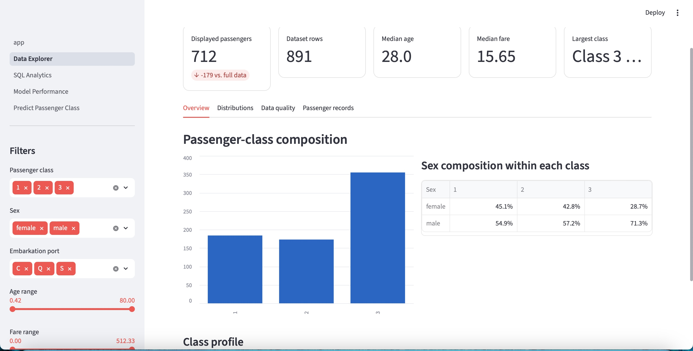
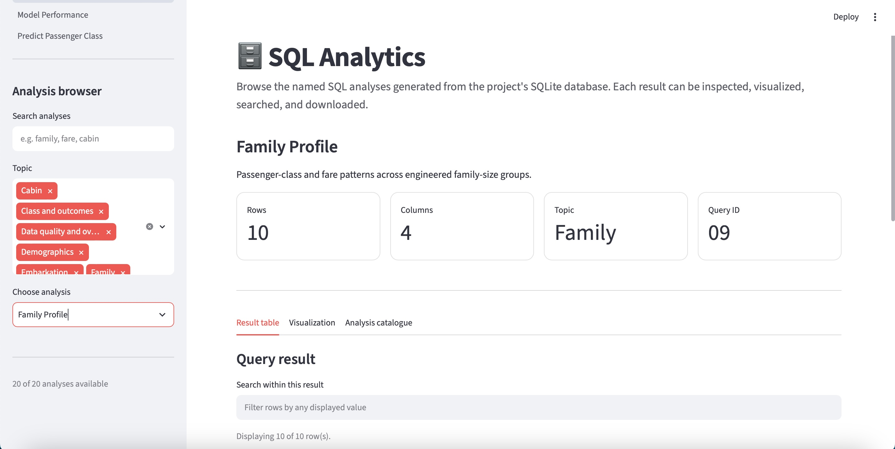
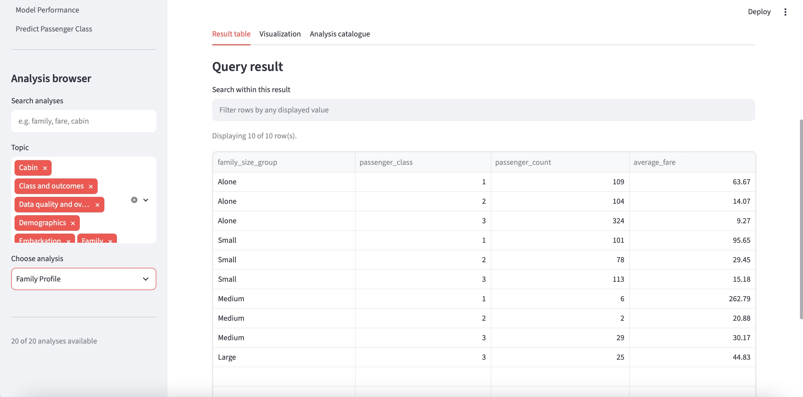
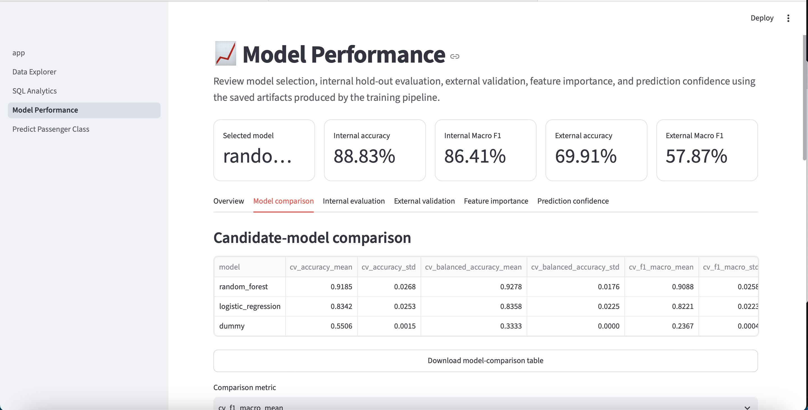
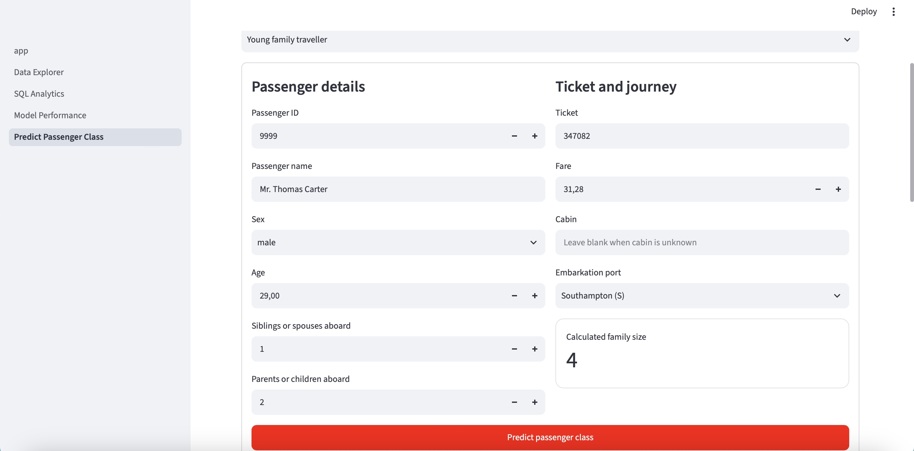
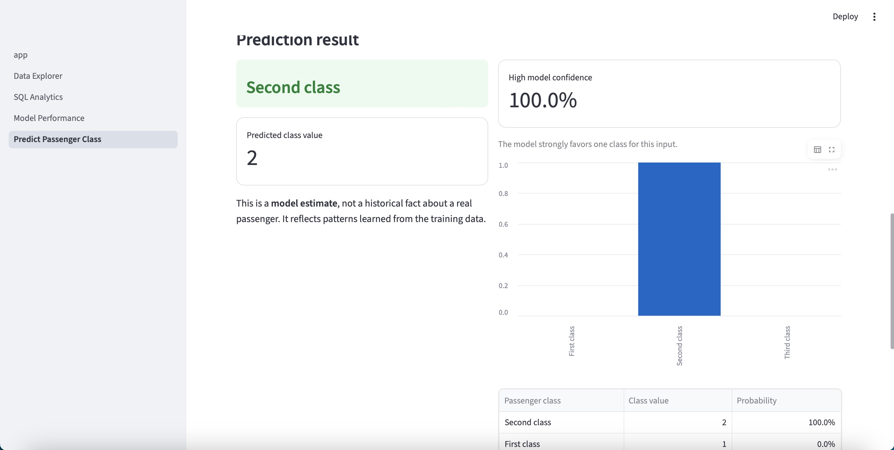

# Titanic Passenger Class Prediction

> **Production-inspired end-to-end machine learning project built with Python, scikit-learn, SQLite, Streamlit, and pytest.**


---

# Overview

This repository demonstrates an end-to-end machine learning workflow using the classic Titanic dataset.

Rather than stopping at a predictive model, this project implements a complete, production-inspired pipeline including:

- Exploratory Data Analysis (EDA)
- Feature engineering
- Model training and comparison
- Automated evaluation
- SQLite database integration
- SQL analytics
- Interactive Streamlit dashboard
- Reusable prediction API
- Automated testing with pytest

The goal is to demonstrate both machine learning and software engineering practices commonly used in real-world data science projects.

---

# Features

- Interactive Streamlit dashboard
- Comprehensive Exploratory Data Analysis
- Feature engineering pipeline
- Candidate model comparison
- SQL analytics using SQLite
- Automated prediction pipeline
- External model validation
- Reusable prediction API
- Automated testing with pytest
- Modular project architecture

---

# Dashboard

The repository includes a multi-page Streamlit application.

---

## Data Explorer

Interactively explore the dataset using filters, descriptive statistics, visualizations, and passenger-level records.



---

## SQL Analytics

Browse SQL reports generated directly from the SQLite database.

View analytical summaries, inspect query results, and download tables.





---

## Model Performance

Review candidate models, compare cross-validation performance, inspect evaluation metrics, and analyze prediction confidence.



---

## Passenger Class Prediction

Generate predictions by entering passenger information through an interactive interface.

The prediction page uses the same preprocessing and feature engineering pipeline employed during model training.



After submitting the form, the dashboard displays:

- Predicted passenger class
- Prediction confidence
- Probability distribution across all classes



---

# Repository Structure

```text
Titanic-Passenger-Class-Prediction
│
├── app/
│   ├── app.py
│   ├── utils.py
│   └── pages/
│
├── artifacts/
│
├── data/
│   ├── raw/
│   └── processed/
│
├── notebooks/
│
├── reports/
│
├── scripts/
│   ├── prepare_data.py
│   ├── build_database.py
│   ├── train.py
│   ├── predict.py
│   └── run_analysis.py
│
├── sql/
│
├── src/
│   └── titanic_passenger_class_prediction/
│
├── tests/
│
└── README.md
```

---

# Dataset

The project uses the classic Titanic passenger dataset.

The objective is to predict passenger class (First, Second, or Third) using passenger characteristics including:

- Age
- Sex
- Fare
- Ticket
- Cabin
- Family information
- Embarkation port

---

# Exploratory Data Analysis

The accompanying notebook performs:

- Dataset overview
- Missing value analysis
- Feature distributions
- Correlation analysis
- Target distribution
- Statistical summaries
- Data visualizations

The notebook documents the reasoning behind feature engineering and model development.

---

# Feature Engineering

The preprocessing pipeline automatically constructs engineered variables including:

- FamilySize
- FamilySizeGroup
- IsAlone
- FareLog
- Passenger Title
- TicketPrefix
- CabinDeck
- CabinCount
- HasCabin

The identical feature engineering pipeline is reused during:

- model training
- batch prediction
- Streamlit predictions

This guarantees consistent predictions across the project.

---

# Machine Learning Workflow

```text
Raw Data
      │
      ▼
Validation
      │
      ▼
Cleaning
      │
      ▼
Feature Engineering
      │
      ▼
Preprocessing Pipeline
      │
      ▼
Model Training
      │
      ▼
Evaluation
      │
      ▼
Saved Artifacts
      │
      ▼
Prediction API
      │
      ▼
Streamlit Dashboard
```

---

# Model Evaluation

Candidate models are evaluated using:

- Accuracy
- Balanced Accuracy
- Macro F1
- Classification Report
- Confusion Matrix
- Internal validation
- External validation

Model artifacts are automatically saved for later inspection.

---

# SQL Analytics

The project integrates SQLite to provide analytical SQL reports covering:

- Passenger demographics
- Passenger-class composition
- Fare analysis
- Family-size profiles
- Embarkation statistics
- Data-quality summaries

These reports are available directly from the Streamlit dashboard.

---

# Software Engineering

Reusable functionality is implemented inside

```text
src/titanic_passenger_class_prediction/
```

while command-line workflows are provided in

```text
scripts/
```

This architecture improves:

- maintainability
- reusability
- testing
- deployment

---

# Testing

The project includes automated tests covering:

- preprocessing
- feature engineering
- model training
- prediction API
- batch prediction workflow

Run all tests:

```bash
pytest -v
```

---

# Technologies

- Python
- pandas
- NumPy
- scikit-learn
- SQLite
- SQL
- Streamlit
- matplotlib
- pytest
- joblib

---

# Installation

```bash
git clone https://github.com/PontusBjorkell/Titanic-Passenger-Class-Prediction.git

cd Titanic-Passenger-Class-Prediction

python -m venv .venv

source .venv/bin/activate

pip install -r requirements.txt
```

---

# Running the Project

Prepare data

```bash
python scripts/prepare_data.py
```

Build SQLite database

```bash
python scripts/build_database.py
```

Train models

```bash
python scripts/train.py
```

Generate predictions

```bash
python scripts/predict.py
```

Launch Streamlit

```bash
streamlit run app/app.py
```

Run tests

```bash
pytest -v
```

---

# Future Improvements

Potential future enhancements include:

- SHAP explainability
- Hyperparameter optimization with Optuna
- Docker support
- GitHub Actions CI/CD
- MLflow experiment tracking
- Streamlit Cloud deployment

---

# About

This repository was created as part of my machine learning and data analytics portfolio. The project emphasizes not only predictive performance, but also reproducibility, software engineering, automated testing, SQL analytics, and interactive presentation through a web application.